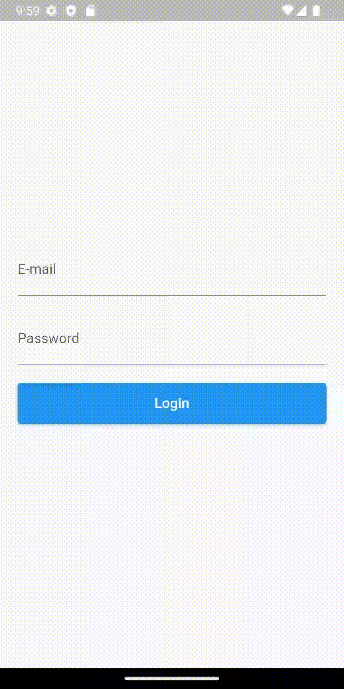

# __Formas de navegação entre telas no Flutter__

<p align="center">

</p>

No flutter é possível navegar entre as telas, essa navegação ocorre em forma de pilha, ou seja, se você sai por exemplo de uma tela de login para uma tela de home sua pilha vai ter na base a screen de login e no topo a screen de home, assim sucessivamente podendo impilhar outras telas. Para navegar na pilha de telas em flutter existe duas formas:

- __Navegação anônima__
- __Navegação nomeada__

# 

## __Navegação anônima__
A navegação anônima ocorre quando você não atribui um nome a uma rota específica e simplesmente exibe o widget correspondente a essa rota usando o método __Navigator__._push_. Por exemplo:

```dart
ElevatedButton(
    onPressed: () {
        // Troca tela
        Navigator.push(
            context,
            MaterialPageRoute(
                builder: (cotext) => const HomeScreen(),
            ),
        );
    },
    child: const Padding(
        padding: EdgeInsets.all(14),
        child: Text(
        'Login',
        style: TextStyle(fontSize: 16),
        ),
    ),
)
```

## __Navegação nomeada__
A navegação nomeada em Flutter é um tipo de navegação que permite que você navegue entre diferentes telas em sua aplicação, usando um nome associado a cada rota. Isso torna a navegação mais fácil de gerenciar e manter, já que você pode usar nomes significativos para as rotas em vez de ter que lembrar de criar e gerenciar uma instância de rota separada para cada tela.

Para usar a navegação nomeada em Flutter, você precisa definir um mapa de rotas no seu aplicativo, que associa um nome a cada rota. Isso é feito usando a propriedade routes do widget __MaterialApp__. Por exemplo:

```dart
MaterialApp(
    debugShowCheckedModeBanner: false,
    title: 'Trabalhando com navigator',
    initialRoute: '/login',
    routes: {
    '/login': (context) => const LoginScreen(),
    '/home': (context) => const HomeScreen(),
    },
);
```
Neste exemplo, definimos duas rotas nomeadas: uma para a __LoginScreen__ e outra para a __HomeScreen__. Agora, você pode navegar para a __HomeScreen__ utilizando seu nome, através do método _pushNamed_ do __Navigator__:

```dart
ElevatedButton(
    onPressed: () {
        Navigator.pushNamed(context, '/home'); // Troca tela
    },
    child: const Padding(
        padding: EdgeInsets.all(14),
        child: Text(
        'Login',
        style: TextStyle(fontSize: 16),
        ),
    ),
)
```

## __Conclusão__

Por fim para sair da tela __HomeScreen__ basta instanciar um _pop_ do __Navigator__,  segue exemplo utilizado no app:

```dart
ElevatedButton(
    onPressed: () {
    Navigator.pop(context);
    // Navigator.of(context).pop('/login');
    },
    child: const Padding(
        padding: EdgeInsets.all(14),
        child: Text(
            'Sair',
            style: TextStyle(fontSize: 16),
        ),
    ),
)
```